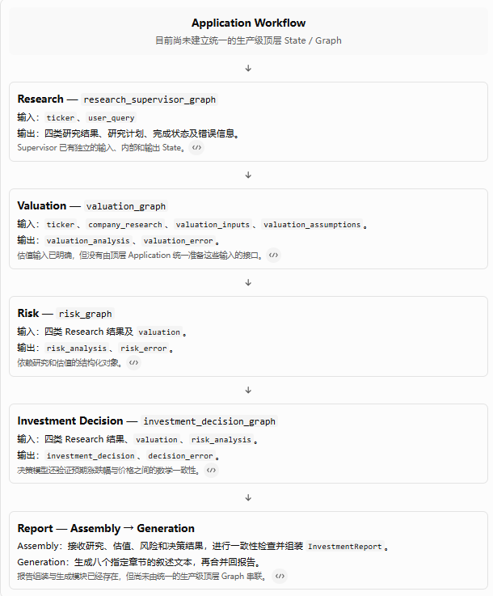

# Production Integration Milestone

## M1：Runtime / Application Architecture

正式开始。我们先完成第一个工程单元：把 Application Graph 的构建职责与 Runtime 的运行基础设施职责分开。

这一步不是重写 Research、Valuation 或 Report，也不是马上把所有阶段接起来。我们先建立后续整合需要依赖的架构边界，再在 M2–M6 中逐步收敛各阶段的契约并重建完整工作流。

### 一、M1 的目标与范围

目前的代码有两个不同层面的问题：

* 架构问题： Graph 的构建与 Checkpointer、数据库连接等运行基础设施不应紧密耦合。

* 业务集成问题： 当前顶层 `graph.py` 仍然是早期教学流程，还没有串联 Phase 4–8 的最终业务能力。

M1 先解决第一个问题。第二个问题留到 M2–M6，避免一边改变 Runtime，一边同时重写整个业务图，导致问题难以定位。

#### 本次修改后的职责边界

```text

Application Runtime:
运行入口、Checkpointer 生命周期、thread_id 配置

 ⬇

Application Graph Factory：
接收可选 Checkpointer，构建并编译 Graph

 ⬇

Domain / Agents：
Research、Valuation、Risk、Decision、Report
```

关键原则：

1. `graph.py` 不主动创建 SQLite 数据库或打开数据库连接。

2. `runtime.py` 是创建可运行应用实例的入口。

3. Graph 接受注入的 Checkpointer，避免绑定某一种持久化后端。

4. `thread_id` 属于运行时配置，而不是投资研究业务模型。

5. 当前默认仍使用 SQLite；这一步不提前引入 PostgreSQL。

6. 不新增 Global SupervisorAgent。顶层业务流程未来仍由 Application Workflow Graph 负责编排。

### 二、代码修改

我已基于当前可读取的项目归档整理了 M1 修改版本：

获取 M1 Runtime Boundary 修改版项目归档

注意： 当前归档中的原始代码是 `After_Phase8` 版本，并不包含你本地 Phase 9 后续全部修改。因此，请把它当作本次修改的参考快照，不要直接覆盖你本地整个项目。下面说明每个改动的作用和验收方法。

#### 修改 1：将 Graph 构建封装为 `build_graph()`

文件：`app/graph/graph.py`

原来文件末尾直接执行：

Python

运行

```
graph = builder.compile()
```

现在将 Graph 的创建、节点注册、边注册和编译封装在：

Python

运行

```
def build_graph(checkpointer=None):
    """Build the application graph with an optional injected checkpointer."""
    builder = StateGraph(
        GraphState,
        input_schema=InputState,
        output_schema=OutputState,
    )

    # 保留现有全部 Node 和 Edge 定义

    return builder.compile(checkpointer=checkpointer)
```

文件末尾保留兼容旧调用方式的对象：

Python

运行

```
graph = build_graph()
```

上面的代码展示的是结构，实际修改时必须把原有全部 `builder.add_node()`、`builder.add_edge()` 和 `builder.add_conditional_edges()` 移入 `build_graph()`，不能只替换文件末尾。

为什么保留 `graph`？

因为当前已有代码和测试可能仍然通过 `from app.graph.graph import graph` 访问 Graph。M1 不应该无必要地破坏这些既有接口。

为什么还需要 `build_graph()`？

因为后续 Runtime 可以根据不同环境注入不同的 Checkpointer，而不需要修改业务图的定义。

#### 修改 2：建立 Checkpointer 工厂

文件：`app/graph/checkpointer.py`

Python

运行

```
from pathlib import Path
import sqlite3

from langgraph.checkpoint.sqlite import SqliteSaver


PROJECT_ROOT = Path(__file__).resolve().parents[2]
DEFAULT_CHECKPOINT_DB_PATH = PROJECT_ROOT / "data" / "checkpoints.sqlite"


def create_checkpointer(
    db_path: str | Path = DEFAULT_CHECKPOINT_DB_PATH,
) -> SqliteSaver:
    """Create a SQLite-backed checkpointer.

    Infrastructure is created explicitly by the runtime layer.
    """
    path = Path(db_path)
    path.parent.mkdir(parents=True, exist_ok=True)

    connection = sqlite3.connect(
        path,
        check_same_thread=False,
    )

    return SqliteSaver(connection)
```

这里的关键不是换了一种写法，而是改变了谁负责创建基础设施。

* `checkpointer.py`：知道如何创建 SQLite Checkpointer。

* `graph.py`：只接收 Checkpointer，不负责创建数据库。

* `runtime.py`：决定何时创建 Checkpointer，并把它交给 Graph。

目前我们仍使用 SQLite，不在 M1 引入新的数据库服务。

#### 修改 3：建立 Runtime 入口

文件：`app/graph/runtime.py`

Python

运行

```
from typing import Any

from langchain_core.runnables import RunnableConfig

from app.graph.checkpointer import create_checkpointer
from app.graph.graph import build_graph


def create_application_runtime(*, checkpointer: Any | None = None):
    """Create a runnable application graph with explicit persistence ownership."""
    if checkpointer is None:
        checkpointer = create_checkpointer()

    return build_graph(checkpointer=checkpointer)


def build_thread_config(thread_id: str) -> RunnableConfig:
    """Build the runtime configuration for a checkpointed thread."""
    if not isinstance(thread_id, str) or not thread_id.strip():
        raise ValueError("thread_id must be a non-empty string")

    return {
        "configurable": {
            "thread_id": thread_id,
        }
    }
```

这里有两个重要接口。

接口 A：创建 Application Runtime

Python

运行

```
runtime = create_application_runtime()
```

默认使用 SQLite。如果测试或其他部署环境需要注入不同的 Checkpointer，也可以传入：

Python

运行

```
runtime = create_application_runtime(
    checkpointer=my_checkpointer,
)
```

这里的 `runtime` 当前仍是一个可运行的 LangGraph Graph 实例，并不是我们已经实现了包含所有基础设施的完整 Runtime 类。我们先建立边界，不为了形式而提前引入额外抽象。

接口 B：构造线程配置

Python

运行

```
config = build_thread_config("research-session-001")

result = runtime.invoke(
    {
        "ticker": "AAPL",
        "user_query": "Analyze the company's investment prospects.",
    },
    config=config,
)
```

上面是接口使用示意。它仍然调用当前的旧 Graph，并不代表完整的 Research → Valuation → Risk → Decision → Report 流程已经实现。

后续重建 Application Graph 时，我们会逐步替换旧业务流程，但尽量保留清晰的 Runtime 调用边界。

#### 修改 4：依赖与本地数据文件

`pyproject.toml` 的运行依赖应包含：

TOML

```
dependencies = [
    "langgraph",
    "langgraph-checkpoint-sqlite",
    "pydantic>=2.0",
]
```

`.gitignore` 应包含：

gitignore

```
data/
```

这样可以避免把本地 SQLite Checkpoint 数据库当成源代码提交。

### 三、M1 完成条件

M1 验收清单

0/10

graph.py 提供 build_graph(checkpointer=None)

graph.py 不主动创建 SQLite 数据库连接

runtime.py 提供 create_application_runtime()

thread_id 通过 Runtime 配置传入

Checkpointer 可以由调用方注入

SQLite 仍是默认本地持久化后端

旧 graph 导入接口保持兼容

不新增 Global SupervisorAgent

不提前实现 HITL、Memory 或 Error Recovery

本地 Runtime 测试和现有 Graph 测试通过

其中，结构性修改和语法检查已有进展；只有你本地执行并确认相关测试通过后，才能正式宣布 M1 完成。

## M2 · Lesson 2：设计最终 Research 契约

本课先解决一个关键问题：Research Supervisor、Planner、四个 Research Agent，以及未来的 Application Workflow Graph，究竟应该通过什么数据结构交互？

这一步决定后续源码应该如何修改。如果接口没有事先设计清楚，即使每个 Agent 单独运行正常，组合起来仍可能出现字段不匹配、状态丢失、错误被吞掉等问题。

本课会先定义契约，再解释每个字段的责任与数据流。最后给出具体的源码修改顺序和验收条件。按照我们刚刚确定的工作方式，本课先完成设计，不直接假设源码已经修改，也不把未经验证的实现说成已经通过测试。

### 一、首先区分四种不同的契约

我们需要明确区分以下四种对象。

1. Input Contract

调用方可以向 Research Supervisor 提供什么？

例如 `ticker`、`user_query`，以及可选的 `research_plan`。

2. Internal State Contract

Supervisor 在执行过程中需要维护什么？

例如计划、下一研究领域、已执行领域、各领域结果和错误记录。

3. Child Agent Contract

每个子 Agent 接收什么，又返回什么？

例如统一接收 `ticker`，返回通用的 `research_result` 和 `research_error`。

4. Output Contract

Research 完成后，下一业务阶段能依赖什么？

四个领域的研究结果、实际研究计划和研究错误记录。

为什么要分开？

因为 Input 是调用方承诺提供的数据，Internal State 是执行过程中的数据，Child Contract 是模块之间的接口，Output 则是整个 Research 子系统对外承诺的结果。

如果把四者全部塞进一个没有边界的 `TypedDict`，项目就会越来越难维护。

### 二、设计 Research Supervisor 的输入契约

建议修改文件：`app/agents/research_supervisor.py`

我们先看调用方的需求。

未来顶层 Application Workflow Graph 需要这样调用 Research：

Python

运行

```
result = research_supervisor_graph.invoke({
    "ticker": "AAPL",
    "user_query": "分析公司的业务、财务状况和市场前景。",
})
```

调用方不应该被迫先调用 Planner，再把 Planner 的结果传给 Supervisor。否则顶层 Graph 仍然需要理解 Research 内部的规划细节。

但我们也希望支持测试或上层指定研究计划的情况：

Python

运行

```
result = research_supervisor_graph.invoke({
    "ticker": "AAPL",
    "user_query": "分析公司的业务和竞争优势。",
    "research_plan": existing_plan,
})
```

因此，输入契约设计为：

| 字段              | 类型                                  | 是否必需 | 职责        |
| --------------- | ----------------------------------- | ---- | --------- |
| `ticker`        | `str`                               | 是    | 研究对象      |
| `user_query`    | `str`                               | 是    | 用户的研究问题   |
| `research_plan` | <code>ResearchPlan \\\| None</code> | 否    | 可选的预先生成计划 |

示意代码：

Python

运行

```
from typing import TypedDict

from app.agents.models import ResearchPlan


class ResearchSupervisorInputState(TypedDict):
    ticker: str
    user_query: str
    research_plan: ResearchPlan | None
```

这里有一个重要的 Python 类型细节：普通 `TypedDict` 中的字段默认都是必需字段，即使它的类型包含 `None`，也不代表调用方可以省略它。

因此，上面这段代码表达的是“必须传入 `research_plan`，但值可以为 `None`”，这并不符合我们的目标。

更合适的设计是使用 `NotRequired`：

Python

运行

```
from typing import NotRequired, TypedDict

from app.agents.models import ResearchPlan


class ResearchSupervisorInputState(TypedDict):
    ticker: str
    user_query: str
    research_plan: NotRequired[ResearchPlan | None]
```

这样才能准确表达：

* 不传 `research_plan`：由 Supervisor 调用 Planner。

* 传入有效的 `ResearchPlan`：直接执行该计划。

* 显式传入 `None`：与未提供计划的情况采用相同的规划路径。

但要注意，`TypedDict` 主要提供静态类型约束，并不会在运行时自动验证 `ticker` 是否为空，也不会替我们验证计划是否合法。这些校验仍然需要在节点中明确执行。

### 三、设计 Supervisor 的内部 State

建议修改文件：`app/agents/research_state.py`

Research 的执行过程需要保存的信息主要有四类：

1. 研究计划与调度位置。

2. 各个领域的研究结果。

3. 已经执行的研究领域。

4. 规划或研究过程中出现的错误。

建议的内部状态结构如下：

Python

运行

```
from typing import Annotated, TypedDict

from app.agents.models import (
    CompanyResearchResult,
    FinancialResearchResult,
    IndustryMacroResearchResult,
    MarketResearchResult,
    ResearchPlan,
    ResearchArea,
)


def merge_research_errors(
    existing: dict[str, str] | None,
    new: dict[str, str] | None,
) -> dict[str, str]:
    merged = dict(existing or {})
    merged.update(new or {})
    return merged


class ResearchSupervisorState(TypedDict, total=False):
    ticker: str
    user_query: str

    research_plan: ResearchPlan
    next_research_area: ResearchArea
    completed_research_areas: list[ResearchArea]

    company_research: CompanyResearchResult | None
    financial_research: FinancialResearchResult | None
    market_research: MarketResearchResult | None
    industry_macro_research: IndustryMacroResearchResult | None

    research_errors: Annotated[
        dict[str, str],
        merge_research_errors,
    ]

    planning_error: str
    supervisor_error: str
```

这段代码的重点不在于字段数量，而在于字段的责任。

#### 1. 为什么 `total=False`？

LangGraph 节点通常只返回自己更新的字段。例如 Company Research 节点只需返回：

Python

运行

```
{
    "company_research": company_result,
}
```

它不需要重新构造整个 ResearchState。

`total=False` 允许这些字段在状态更新中逐步出现。

不过，这也意味着某个字段可能尚未初始化。因此节点在读取状态时，需要考虑字段不存在的情况。

#### 2. 为什么保留四个领域的独立字段？

因为这四个结果属于不同的 Domain Model：

* `CompanyResearchResult`

* `FinancialResearchResult`

* `MarketResearchResult`

* `IndustryMacroResearchResult`

它们虽然都是研究结果，但字段和语义并不相同。

如果把它们全部压成一个通用的 `dict[str, object]`，就会失去静态类型检查带来的好处，也会让 Valuation、Risk 和 Report 更难明确自己依赖什么数据。

#### 3. 为什么 `research_errors` 需要 Reducer？

假设执行两个研究任务：

Python

运行

```
{
    "research_errors": {
        "company": "Company data unavailable"
    }
}
```

随后另一个任务返回：

Python

运行

```
{
    "research_errors": {
        "market": "Market provider timeout"
    }
}
```

通过合并 Reducer，最终状态可以保留两条错误，而不是让后一条覆盖前一条。

当前 M2 选择顺序执行，因此不会出现多个并行节点同时写入相同字段的情况。不过，Reducer 仍然能明确规定错误记录的合并语义。

需要注意：如果同一个错误键被重复写入，当前实现会采用后一次写入的值。后续若需要保留同一领域的完整错误历史，可以另行设计列表或结构化错误记录；当前阶段不需要提前增加复杂度。

#### 4. 为什么规划错误与研究错误分开？

`planning_error` 表示 Planner 没有生成有效计划。

`research_errors` 表示某个研究领域执行失败。

`supervisor_error` 表示编排本身出现问题，例如无法处理计划中指定的领域。

它们不能随意混用。否则后续系统很难区分“研究数据不可用”与“系统无法正确调度研究”。

同时，这里不把所有错误包装成统一的复杂异常框架，因为那属于后续 Error Recovery 阶段的扩展范围。

### 四、设计子 Agent 的统一输出契约

涉及四个子图：

* `company_research.py`

* `financial_research.py`

* `market_research.py`

* `industry_macro_research.py`

它们的内部研究逻辑可以不同，但 Supervisor 与它们之间的接口应该一致。

建议统一采用以下结构：

Python

运行

```
from typing import TypedDict


class ResearchAgentOutputState(TypedDict):
    research_result: object | None
    research_error: str
```

这段代码只是说明统一接口的概念。实际实现时，应该优先保留现有领域 State 中的精确类型，而不是把生产代码中的结果全部改成 `object`。

更好的做法是分别声明领域输出：

Python

运行

```
class CompanyResearchOutputState(TypedDict):
    research_result: CompanyResearchResult | None
    research_error: str
```

其余三个领域采用相同的结构，但替换为各自的 Pydantic 模型类型。

为什么不让 Company Research 直接返回 `company_research`？

因为子 Agent 应该只负责自己的领域任务，而不是依赖上层 Supervisor 的内部状态命名。这样将来即使某个子 Agent 被单独调用，或在其他工作流中复用，也不需要修改它的输出契约。

#### Supervisor 如何完成映射？

例如，Company Research 子图返回：

Python

运行

```
{
    "research_result": company_result,
    "research_error": "",
}
```

Supervisor 负责转换为：

Python

运行

```
{
    "company_research": company_result,
}
```

如果子图失败，则转换为：

Python

运行

```
{
    "company_research": None,
    "research_errors": {
        "company": "Company data unavailable",
    },
}
```

适配责任属于 Supervisor，而不是子 Agent。

另外，不能只根据 `research_error` 是否为空就忽略其他情况。如果子图没有返回 `research_result`，却也没有返回错误，Supervisor 应将其视为无效输出并记录错误，而不是误判为成功。

### 五、设计 Research 的对外输出契约

建议在 `research_supervisor.py` 中单独定义输出 State：

Python

运行

```
from typing import TypedDict

from app.agents.models import (
    CompanyResearchResult,
    FinancialResearchResult,
    IndustryMacroResearchResult,
    MarketResearchResult,
    ResearchPlan,
)


class ResearchSupervisorOutputState(TypedDict):
    ticker: str
    research_plan: ResearchPlan

    company_research: CompanyResearchResult | None
    financial_research: FinancialResearchResult | None
    market_research: MarketResearchResult | None
    industry_macro_research: IndustryMacroResearchResult | None

    research_errors: dict[str, str]
```

这里有两个值得解释的设计决定。

第一，输出 State 不暴露内部调度字段。

`next_research_area` 和 `completed_research_areas` 是 Supervisor 的内部实现细节。调用方不需要知道 Supervisor 是如何循环调度任务的。

第二，研究结果允许为 `None`，但计划必须明确。

研究计划已经通过验证并开始执行后，即使某个领域失败，也应该返回有效的计划和已成功获得的其他研究结果。

如果 Planner 失败，则不应伪造一个空的 `ResearchPlan` 来满足输出类型。这个情况应走明确的规划失败路径，返回错误信息，而不是声称 Research 成功完成。

这也说明：输出 State 的类型定义并不能单独表达所有业务不变量。成功与失败的最终语义仍需要在节点逻辑和后续测试中明确验证。

### 六、最终数据流

现在将这些契约组合起来：

ResearchSupervisorInputState

ticker + user_query + optional research_plan

Plan / Validate

需要时调用 Planner，验证计划

Sequential Research Execution

调用子图 → 读取通用输出 → 映射领域字段 → 记录错误

ResearchSupervisorOutputState

计划、四个领域的研究结果、错误记录

Application Workflow Graph

下一阶段由顶层 Graph 决定

这条链路明确了各模块之间的边界，也为后续 M3 的 Application State / Contract Convergence 做好了准备。

### 七、源码修改顺序与验收标准

本课先完成契约设计，后续源码修改按依赖顺序执行：

1. `app/agents/research_state.py`：移除 Valuation 耦合，确定 Research 内部状态。

2. 四个 Research 子图的输出 State：确保通用结果与错误字段一致，同时保留各领域精确类型。

3. `app/agents/research_supervisor.py`：统一输入、内部 State、输出 State，整合 Planner，并实现可靠的结果映射。

4. 对应测试文件：覆盖规划、调度、结果映射、部分失败与无效子图输出。

5. 最后检查旧 Orchestrator、Router、Parallel、Fan-out 实现是否仍被生产代码依赖，再决定如何迁移或弃用。

M2 的验收条件是：

* 输入契约允许上层提供 `ticker`、`user_query`，并可选地提供 `research_plan`。

* 未提供计划时，Supervisor 能调用 Planner。

* 四个子 Agent 的输出契约一致，且保留领域结果的精确类型。

* Supervisor 能把通用子图结果映射到正确的领域字段。

* 单个领域失败不会被误判为成功，也不会无故抹去其他研究结果。

* Planner 失败与子 Agent 失败有明确区别。

* ResearchState 不再直接依赖 Valuation。

* Research 对外输出不泄露内部调度细节。

本课的结论： 我们已经确定了 M2 的目标契约，但还没有宣称源码已完成这些修改。

## M2 · Lesson 3：Research Supervisor 正式接管 Research 阶段

本课的目标不是简单地让 `research_supervisor.py` 调用 Planner，而是把 Research 阶段整理成一套状态边界清晰、子 Agent 契约统一、错误可追踪、可以独立测试的正式编排模块。

先说明一个源码基线问题：当前对话中能够读取的项目压缩包是 `Investment-Research-Decision-Agent_After_Phase8.tar`，并非已经包含最新 M1 修改的代码。因此，下面的修改基于这份可用源码；本课不修改 M1 的 Runtime 和 Application Graph，也不假定这些文件与你本地版本完全一致。

### 一、本课完成后的架构

ResearchSupervisorInputState

ticker · user_query

Plan Research

内部调用 Research Planner，生成 ResearchPlan

Select Next Research Area

从计划中选择尚未完成的研究领域

没有待执行领域

结束并返回结果

执行子 Agent

按 ResearchArea 选择一个子图

Adapt Child Output → Mark Completed

映射研究结果、记录错误、更新完成列表

返回 Select Next Research Area，直到完成

本课最重要的架构决定有四个：

1. 正式 `ResearchSupervisorState` 自己定义完整的 Research 状态，不再继承 `ResearchState`。

2. Supervisor 内部调用 Planner；上层只需要提供 `ticker` 和 `user_query`，不再要求调用方先生成 `research_plan`。

3. 子 Agent 统一返回 `research_result` 和 `research_error`，由 Supervisor 负责映射到各自的领域结果字段。

4. 旧版 Fanout、Parallel、Orchestrator 等暂时保留，但明确作为旧教学流程，并修正它们与子 Agent 之间已有的契约不匹配。

### 二、先解决状态定义：正式状态与旧教学状态分离

之前的设计让 Supervisor 继承 `ResearchState`，但这个公共类型同时被历史教学模块使用，甚至曾经包含 Valuation 字段。这让正式 Research 架构的边界不够清楚。

本课调整为：

* `ResearchSupervisorState`：正式 Research Supervisor 的唯一内部状态定义。

* `ResearchSupervisorInputState`：正式输入契约。

* `ResearchSupervisorOutputState`：正式输出契约。

* `LegacyResearchState`：仅供尚未退役的旧教学流程使用。

* `research_errors.py`：只负责错误字典的 reducer，不再把 reducer 和公共状态类型绑定在同一个模块里。

因此，正式 Supervisor 不再依赖 `LegacyResearchState`，Valuation 也不再依赖旧 Research 状态模块。

#### 1. 新增 `app/agents/research_errors.py`

Python

运行

```
def merge_research_errors(
    existing: dict[str, str] | None,
    new: dict[str, str] | None,
) -> dict[str, str]:
    """Merge keyed errors returned by child research graphs."""

    merged = dict(existing or {})
    merged.update(new or {})
    return merged
```

这个 reducer 的职责很单一：把不同研究节点返回的错误字典合并起来。

例如：

Python

运行

```
existing = {"company": "Company provider failed."}
new = {"financial": "Financial provider failed."}

# 合并后：
{
    "company": "Company provider failed.",
    "financial": "Financial provider failed.",
}
```

为什么不直接删除 reducer？因为即使正式 Supervisor 改为顺序执行，旧 Parallel/Fanout 教学图仍可能在同一轮更新中并发返回多个错误。Reducer 依然有价值，只是不应该因此强迫正式 Supervisor 继承一套历史状态类型。

#### 2. 修改 `app/agents/research_state.py`

该文件现在只保留旧教学工作流所需的状态类型：

Python

运行

```
from typing import Annotated, TypedDict

from app.agents.research_errors import merge_research_errors
from app.agents.models import (
    CompanyResearchResult,
    FinancialResearchResult,
    IndustryMacroResearchResult,
    MarketResearchResult,
    ResearchArea,
    ResearchPlan,
)


class LegacyResearchState(TypedDict, total=False):
    """Legacy shared state for teaching-era research workflows.

    The production ResearchSupervisor defines its own state contract and
    does not inherit this TypedDict. Keep this type only while legacy
    examples are retained and tested.
    """

    ticker: str
    research_plan: ResearchPlan
    next_research_area: ResearchArea

    company_research: CompanyResearchResult | None
    financial_research: FinancialResearchResult | None
    market_research: MarketResearchResult | None
    industry_macro_research: IndustryMacroResearchResult | None

    research_errors: Annotated[
        dict[str, str],
        merge_research_errors,
    ]
```

这里的 `LegacyResearchState` 不是新的正式架构抽象，而是迁移期间为旧代码保留的明确标记。

当 Fanout、Parallel、旧 Orchestrator 等教学实验被正式退役，而且不再有测试或模块依赖它们时，我们就可以删除这份旧状态定义及其专用文件。现在直接删除，会让这些仍保留的模块失去状态定义，因此本课不贸然删除。

### 三、重构 `app/agents/research_supervisor.py`

这是本课的核心修改。

#### 1. 输入、内部状态、输出状态

三个状态类型不再继承 `LegacyResearchState`，而是各自清晰地声明契约。

Python

运行

```
from typing import Annotated, TypedDict

from langgraph.graph import END, START, StateGraph

from app.agents.company_research import company_research_graph
from app.agents.financial_research import financial_research_graph
from app.agents.industry_macro_research import (
    industry_macro_research_graph,
)
from app.agents.market_research import market_research_graph
from app.agents.models import (
    CompanyResearchResult,
    FinancialResearchResult,
    IndustryMacroResearchResult,
    MarketResearchResult,
    ResearchArea,
    ResearchPlan,
)
from app.agents.research_planner import research_planner_graph
from app.agents.research_errors import merge_research_errors


class ResearchSupervisorInputState(TypedDict):
    """Public input contract for the complete Research stage."""

    ticker: str
    user_query: str


class ResearchSupervisorState(TypedDict, total=False):
    """Internal state owned by ResearchSupervisor."""

    ticker: str
    user_query: str
    research_plan: ResearchPlan | None

    next_research_area: ResearchArea | None
    completed_research_areas: list[ResearchArea]

    company_research: CompanyResearchResult | None
    financial_research: FinancialResearchResult | None
    market_research: MarketResearchResult | None
    industry_macro_research: IndustryMacroResearchResult | None

    research_errors: Annotated[
        dict[str, str],
        merge_research_errors,
    ]
    planning_error: str
    supervisor_error: str


class ResearchSupervisorOutputState(TypedDict, total=False):
    """Stable output contract returned to the parent application graph."""

    ticker: str
    research_plan: ResearchPlan | None
    completed_research_areas: list[ResearchArea]

    company_research: CompanyResearchResult | None
    financial_research: FinancialResearchResult | None
    market_research: MarketResearchResult | None
    industry_macro_research: IndustryMacroResearchResult | None

    research_errors: dict[str, str]
    planning_error: str
    supervisor_error: str
```

注意 `total=False`：这些字段可以在运行过程中逐步填充，不要求图在每个节点返回所有字段。

输入契约则保持严格：调用正式 Research Supervisor 时，需要提供 `ticker` 和 `user_query`。

#### 2. Planner 集成到 Supervisor 内部

新增 `plan_research()`，让 Supervisor 自己完成规划。

Python

运行

```
def plan_research(
    state: ResearchSupervisorState,
) -> ResearchSupervisorState:
    """Create the research plan inside the Supervisor boundary."""

    ticker = state.get("ticker", "").strip()
    if not ticker:
        message = "Ticker is required for research execution."
        return {
            "research_plan": None,
            "planning_error": "",
            "supervisor_error": message,
        }

    user_query = state.get("user_query", "").strip()
    if not user_query:
        message = "User query is required for research planning."
        return {
            "research_plan": None,
            "planning_error": message,
            "supervisor_error": message,
        }

    try:
        result = research_planner_graph.invoke(
            {"user_query": user_query}
        )
    except Exception as exc:
        message = f"Research planner invocation failed: {exc}"
        return {
            "research_plan": None,
            "planning_error": message,
            "supervisor_error": message,
        }

    research_plan = result.get("research_plan")
    planning_error = result.get("planning_error", "")

    if planning_error or research_plan is None:
        message = planning_error or "Research planner returned no plan."
        return {
            "research_plan": research_plan,
            "planning_error": message,
            "supervisor_error": message,
        }

    return {
        "research_plan": research_plan,
        "planning_error": "",
        "supervisor_error": "",
    }
```

这里有两个不同的错误字段：

* `planning_error`：规划阶段失败，例如 LLM 调用失败或 Planner 没有生成有效计划。

* `supervisor_error`：Supervisor 自身无法继续执行，例如输入缺少股票代码或规划结果不可用。

它们都属于流程级错误，应该阻止研究流程继续进入子 Agent。

另外，Planner 仍然只接收 `user_query`。`ticker` 是执行子 Agent 时使用的上下文；Planner 的职责是选择研究领域，而不是执行研究。

#### 3. 选择下一个研究领域

Python

运行

```
def select_next_research_area(
    state: ResearchSupervisorState,
) -> ResearchSupervisorState:
    """Select the next uncompleted area in the planner's requested order."""

    if state.get("planning_error") or state.get("supervisor_error"):
        return {"next_research_area": None}

    plan = state.get("research_plan")
    if plan is None:
        return {
            "next_research_area": None,
            "supervisor_error": "Research plan is unavailable.",
        }

    completed = set(state.get("completed_research_areas", []))

    for research_area in plan.research_areas:
        if research_area not in completed:
            return {"next_research_area": research_area}

    return {"next_research_area": None}
```

这里尊重 Planner 返回的 `research_areas` 顺序，而不是再使用另一套 `RESEARCH_ORDER` 覆盖它。

当所有领域都已完成时，`next_research_area` 为 `None`，图即可结束。

#### 4. 统一子 Agent 契约并映射结果

这是之前 Supervisor 的关键缺陷之一。

实际的四个子 Agent 都返回同一类契约：

Python

运行

```
{
    "research_result": ...,  # 对应领域的 Pydantic 结果或 None
    "research_error": "",    # 成功时为空字符串
}
```

Supervisor 不能再假设子 Agent 返回 `company_research` 或 `research_errors`。它应该先读取统一字段，再按领域写入自己的状态。

Python

运行

```
def route_and_execute(
    state: ResearchSupervisorState,
) -> ResearchSupervisorState:
    """Invoke one child graph and adapt its output to the supervisor contract."""

    research_area = state.get("next_research_area")
    if research_area is None:
        return {
            "supervisor_error": "No research area was selected for execution."
        }

    child_graphs = {
        ResearchArea.COMPANY: company_research_graph,
        ResearchArea.FINANCIAL: financial_research_graph,
        ResearchArea.MARKET: market_research_graph,
        ResearchArea.INDUSTRY_MACRO: industry_macro_research_graph,
    }
    result_fields = {
        ResearchArea.COMPANY: "company_research",
        ResearchArea.FINANCIAL: "financial_research",
        ResearchArea.MARKET: "market_research",
        ResearchArea.INDUSTRY_MACRO: "industry_macro_research",
    }

    child_graph = child_graphs.get(research_area)
    result_field = result_fields.get(research_area)

    if child_graph is None or result_field is None:
        return {
            "supervisor_error": f"Unsupported research area: {research_area}"
        }

    try:
        child_output = child_graph.invoke(
            {"ticker": state["ticker"]}
        )
        child_result = child_output.get("research_result")
        child_error = child_output.get("research_error", "")
    except Exception as exc:
        child_result = None
        child_error = f"Child research graph invocation failed: {exc}"

    update: dict = {result_field: child_result}

    if child_error:
        update["research_errors"] = {
            research_area.value: child_error
        }
    else:
        update["research_errors"] = {}

    return update
```

为什么在这里捕获子图调用异常？

因为一个研究领域失败，不应该自动让其他已计划的研究领域全部失去执行机会。例如，公司信息服务不可用时，财务研究仍可能成功。

因此，本课区分两种失败：

* 子 Agent 返回 `research_error`，或调用子图发生异常：将错误记入 `research_errors`，继续其他领域。

* Planner 或 Supervisor 的流程状态无效：设置流程级错误，结束图。

这不是完整的 Error Recovery 机制；重试、超时、降级策略仍属于后续生产集成工作。本课只确保错误有正确的归属和控制流。

#### 5. 更新完成状态和路由条件

Python

运行

```
def mark_completed(
    state: ResearchSupervisorState,
) -> ResearchSupervisorState:
    """Mark the selected research area complete, even when its child failed."""

    current = state.get("next_research_area")
    if current is None:
        return {
            "supervisor_error": "No research area is available to mark complete."
        }

    completed = list(state.get("completed_research_areas", []))
    if current not in completed:
        completed.append(current)

    return {
        "completed_research_areas": completed,
        "next_research_area": None,
        "supervisor_error": "",
    }


def supervisor_should_continue(
    state: ResearchSupervisorState,
) -> str:
    """Route to execution, finish, or stop on a planning/supervisor error."""

    if state.get("planning_error") or state.get("supervisor_error"):
        return "error"

    if state.get("next_research_area") is None:
        return "done"

    return "execute"
```

这里将“完成”定义为该领域已经执行并且结果已处理，不代表研究一定成功。因此，某个子 Agent 失败也会记录为已处理，避免 Supervisor 在没有重试策略的情况下反复执行同一领域。

#### 6. 正式图的构建

Python

运行

```
def build_research_supervisor_graph():
    """Build the production Research-stage graph."""

    builder = StateGraph(
        ResearchSupervisorState,
        input_schema=ResearchSupervisorInputState,
        output_schema=ResearchSupervisorOutputState,
    )

    builder.add_node("plan_research", plan_research)
    builder.add_node(
        "select_next_research_area",
        select_next_research_area,
    )
    builder.add_node("route_and_execute", route_and_execute)
    builder.add_node("mark_completed", mark_completed)

    builder.add_edge(START, "plan_research")
    builder.add_edge("plan_research", "select_next_research_area")

    builder.add_conditional_edges(
        "select_next_research_area",
        supervisor_should_continue,
        {
            "execute": "route_and_execute",
            "done": END,
            "error": END,
        },
    )

    builder.add_edge("route_and_execute", "mark_completed")
    builder.add_edge(
        "mark_completed",
        "select_next_research_area",
    )

    return builder.compile()


research_supervisor_graph = build_research_supervisor_graph()
```

现在正式入口的执行顺序是：

`START → Planner → 选择研究领域 → 执行子 Agent → 更新完成状态 → 选择下一个领域 → END`

注意，这里是顺序执行。我们已经选择 Supervisor 作为正式编排边界，因此不再让 Supervisor 同时维护另一套 Fanout 或 Parallel 执行策略。

### 四、修正旧工作流中的子 Agent 契约

虽然旧工作流不再是正式 Research 入口，但它们仍被保留用于教学和回归测试。审计时发现，旧模块也存在与实际子 Agent 输出契约不一致的问题。

本课一并修正，避免出现“Supervisor 已经正常，旧测试模块却仍消费错误字段”的情况。

#### 1. `research_parallel.py` 和 `research_fanout.py`

这两个旧模块都采用同一套适配逻辑：

Python

运行

```
def _adapt_child_result(
    result: dict,
    result_field: str,
    area: ResearchArea,
) -> dict:
    error = result.get("research_error", "")

    return {
        result_field: result.get("research_result"),
        "research_errors": {
            area.value: error
        } if error else {},
    }
```

例如，Company Research Agent 返回：

Python

运行

```
{
    "research_result": company_result,
    "research_error": "",
}
```

旧 Parallel/Fanout 的适配层会将它转换为：

Python

运行

```
{
    "company_research": company_result,
    "research_errors": {},
}
```

如果子 Agent 失败，则转换为：

Python

运行

```
{
    "company_research": None,
    "research_errors": {
        "company": "Provider unavailable."
    },
}
```

这样，子 Agent 的统一契约和父级工作流的领域结果字段就各司其职，不再要求每个子 Agent 都理解父图内部的状态结构。

#### 2. `research_orchestrator.py`

旧 Orchestrator 通过 Router 执行子 Agent。Router 已经返回通用字段：

* `routed_area`

* `research_result`

* `research_error`

* `routing_error`

所以 Orchestrator 的 `_route_and_execute()` 现在根据 `ResearchArea` 将 `research_result` 写入对应字段，并把 `research_error` 转换成以领域名称为键的错误字典。

核心映射逻辑如下：

Python

运行

```
update: ResearchOrchestratorState = {
    "routed_area": result.get("routed_area"),
    "routing_error": result.get("routing_error", ""),
    "research_errors": {},
}

child_error = result.get("research_error", "")
if child_error:
    update["research_errors"] = {
        research_area.value: child_error
    }

result_field_by_area = {
    ResearchArea.COMPANY: "company_research",
    ResearchArea.FINANCIAL: "financial_research",
    ResearchArea.MARKET: "market_research",
    ResearchArea.INDUSTRY_MACRO: "industry_macro_research",
}

result_field = result_field_by_area.get(research_area)
if result_field is not None:
    update[result_field] = result.get("research_result")

return update
```

同时，`ResearchOrchestratorOutputState` 增加了 `completed_research_areas`，以便旧工作流的输出契约与它实际维护的完成状态一致。

#### 3. `valuation.py`

删除对 `ResearchState` 的导入。

Valuation 已经拥有独立的 `ValuationInputState`、`ValuationGraphState` 和 `ValuationOutputState`。继续导入 Research 状态既没有必要，也会让 Valuation 与 Research 产生不必要的模块依赖。

本课还修改了 `tests/test_valuation_agent.py`，使相关测试检查 Valuation 自己的输入边界，而不是通过 Research 状态来描述 Valuation。

### 五、Planner 契约和测试同步修正

当前 `research_planner.py` 的实现使用 `planning_error` 表示规划失败或成功状态，但原有 `tests/test_research_planner.py` 却断言 `research_error`。这两者不一致。

本课保留实现中语义更准确的 `planning_error`，同步修正测试，而不是同时支持两个名称。

正式 Supervisor 的输入也发生了变化：

旧的调用方式：

Python

运行

```
{
    "ticker": "AAPL",
    "research_plan": plan,
}
```

新的调用方式：

Python

运行

```
{
    "ticker": "AAPL",
    "user_query": "Research AAPL comprehensively.",
}
```

现在由 Supervisor 内部调用 Planner。测试也随之更新，覆盖以下情况：

* Planner 返回完整计划，Supervisor 按计划执行。

* Planner 只选择部分领域，其他领域不执行。

* 子 Agent 失败，错误被记录，其他已计划的领域继续执行。

* Planner 失败，Supervisor 不调用任何子 Agent。

* `user_query` 或 `ticker` 为空时，提前终止流程。

* Supervisor 的状态包含全部四类研究结果，但不包含 Valuation 字段。

* 旧 Parallel、Fanout 和 Orchestrator 使用真实子 Agent 契约进行测试。

### 六、所有修改文件

本课修改涉及以下源码与测试文件。

| 文件                                      | 修改内容                                                                  |
|-------------------------------------------|---------------------------------------------------------------------------|
| `app/agents/research_supervisor.py`       | 正式状态独立定义、内部调用 Planner、统一子 Agent 适配、错误路由和完成状态 |
| `app/agents/research_errors.py`           | 新增独立的研究错误 reducer                                                |
| `app/agents/research_state.py`            | 将公共类型改为 `LegacyResearchState`，移除 Valuation 耦合                 |
| `app/agents/research_parallel.py`         | 修正旧 Parallel 的子 Agent 结果和错误映射                                 |
| `app/agents/research_fanout.py`           | 修正旧 Fanout 的子 Agent 结果和错误映射                                   |
| `app/agents/research_orchestrator.py`     | 修正 Router 输出适配，补全输出状态                                        |
| `app/agents/valuation.py`                 | 删除不必要的 Research 状态依赖                                            |
| `tests/test_research_supervisor.py`       | 更新输入契约，覆盖规划失败、子 Agent 错误和独立状态                       |
| `tests/test_research_planner.py`          | 统一使用 `planning_error`                                                 |
| `tests/test_research_state.py`            | 检查旧状态不再定义 Valuation 字段                                         |
| `tests/test_valuation_agent.py`           | 检查 Valuation 自己的输入契约                                             |
| `tests/test_research_parallel.py`         | 更新子 Agent Mock 输出契约                                                |
| `tests/test_research_parallel_fan_out.py` | 更新 Fanout 的子 Agent Mock 输出契约                                      |
| `tests/test_research_orchestrator.py`     | 更新 Router Mock 契约和旧 Orchestrator 的回归测试                         |

为了方便你一次性应用所有修改，我也生成了完整的源码补丁文件。它是源码差异，不是替代教学说明的项目压缩包。

获取 M2 Lesson 3 源码补丁

补丁针对本课读取到的 `After_Phase8` 源码生成。由于原文件包含 Windows 换行格式，应用时建议使用：

Bash

```
git apply --ignore-space-change --ignore-whitespace M2_Lesson3.patch
```

如果你的本地版本已经包含后续 M1 修改，请先检查补丁差异，不要直接覆盖已有的 Runtime 或 Application Graph 代码。

### 七、验证与验收标准

我在当前可用的源码副本上执行了 Python 语法编译检查，`app` 和 `tests` 目录的 `compileall` 检查通过。

补丁也通过了针对当前源码基线的 `git apply --check` 检查。

但当前执行环境没有安装 `langgraph` 和 `langchain_core`，因此 pytest 在测试收集阶段就因依赖缺失而失败，目前不能宣称这批测试已经通过。

请在你本地已配置好的项目虚拟环境中执行以下命令。

先运行本课涉及的回归测试：

Bash

```
pytest -q tests/test_research_supervisor.py tests/test_research_planner.py tests/test_research_state.py tests/test_research_router.py tests/test_research_orchestrator.py tests/test_research_parallel.py tests/test_research_parallel_fan_out.py tests/test_valuation_agent.py
```

专项测试通过后，再执行全量测试：

Bash

```
pytest -q
```

### 本课验收条件

* Supervisor 可以只接收 `ticker` 和 `user_query`，并在内部调用 Planner。

* Supervisor 自己定义完整的 Research 状态，不继承 `LegacyResearchState`。

* 四种子 Agent 都通过 `research_result` / `research_error` 契约与父级交互。

* 结果被正确映射到四个领域专属字段。

* 单个子 Agent 的失败会记录在 `research_errors`，且不会阻止其他已计划领域执行。

* Planner 或 Supervisor 的流程级错误会终止后续执行。

* Valuation 不再依赖 Research 状态模块。

* 旧 Router、Orchestrator、Parallel、Fanout 的相关测试与实际子 Agent 契约一致。

* 本课专项测试和全量测试均通过。

## M2 Lesson 4：统一 Research 子 Agent 契约

### 一、本课最终要建立的接口

四个子 Agent 都接受相同的输入：

Python

运行

```
{"ticker": "AAPL"}
```

成功时，统一返回：

Python

运行

```
{
    "research_result": <对应领域的 Pydantic 模型>,
    "research_error": "",
}
```

失败时，统一返回：

Python

运行

```
{
    "research_result": None,
    "research_error": "具体错误原因",
}
```

这里需要注意：只统一接口，不统一领域模型。

* 公司研究仍使用 `CompanyResearchResult`。

* 财务研究仍使用 `FinancialResearchResult`。

* 市场研究仍使用 `MarketResearchResult`。

* 行业与宏观研究仍使用 `IndustryMacroResearchResult`。

同时，Supervisor 需要区分普通研究失败和接口契约错误。普通研究失败可以记录后继续其他研究领域；接口契约错误则应该终止当前 Research 阶段，避免产生不可信的结果。

### 二、新增公共契约模块

新建文件：`app/agents/research_contracts.py`

请将以下内容完整复制到这个新文件中。

Python

运行

```
"""Shared contract helpers for Research child agents."""

from typing import Any, TypeVar

from pydantic import BaseModel


ResearchResultT = TypeVar(
    "ResearchResultT",
    bound=BaseModel,
)


def require_research_result(
    result: Any,
    expected_type: type[ResearchResultT],
) -> ResearchResultT:
    """Validate that a child agent returned its expected domain model."""

    if not isinstance(result, expected_type):
        raise TypeError(
            "Research agent returned an invalid structured result: "
            f"expected {expected_type.__name__}, "
            f"received {type(result).__name__}."
        )

    return result


def research_success(
    result: ResearchResultT,
) -> dict[str, Any]:
    """Build the standard success payload."""

    if not isinstance(result, BaseModel):
        raise TypeError(
            "Research success payload requires a validated Pydantic result; "
            f"received {type(result).__name__}."
        )

    return {
        "research_result": result,
        "research_error": "",
    }


def research_failure(
    error: Exception,
) -> dict[str, Any]:
    """Build the standard failure payload."""

    message = str(error).strip() or type(error).__name__

    return {
        "research_result": None,
        "research_error": message,
    }
```

#### 这个模块解决什么问题？

过去，四个 Agent 各自手动创建成功和失败字典。以后它们调用同一组函数构建输出，减少重复实现。

`require_research_result()` 则增加运行时类型验证。例如，公司研究 Agent 返回了 `None` 或一个普通字典时，系统不会把它当作有效的公司研究结果。

这里的类型验证依赖现有项目使用的 Pydantic 模型，不需要修改 `app/agents/models.py`。

### 三、修改 Company Research Agent

文件：`app/agents/company_research.py`

#### 修改 1：增加 import

找到原来的：

Python

运行

```
from app.agents.models import CompanyResearchResult
```

在它下面增加：

Python

运行

```
from app.agents.research_contracts import (
    require_research_result,
    research_failure,
    research_success,
)
```

#### 修改 2：替换 `company_research_agent()` 函数

请在该文件中找到现有的 `company_research_agent()`，将整个函数替换为以下版本。文件中的 `build_company_research_graph()` 和其他代码保持不变。

Python

运行

```
def company_research_agent(
    state: CompanyResearchState,
) -> CompanyResearchState:
    ticker = state["ticker"]

    prompt_value = company_research_prompt.invoke(
        {"ticker": ticker}
    )

    try:
        tool_result = company_research_tool_loop.invoke(
            {
                "messages": prompt_value.messages,
            }
        )

        research_context = extract_tool_results(tool_result)

        structured_result = (
            structured_company_research_llm.invoke(
                [
                    *prompt_value.messages,
                    HumanMessage(
                        content=(
                            "Tool results:\n"
                            f"{research_context}\n\n"
                            "Using only these tool results, "
                            "produce the structured company "
                            "research result."
                        )
                    ),
                ]
            )
        )

        structured_result = require_research_result(
            structured_result,
            CompanyResearchResult,
        )

    except Exception as exc:
        return research_failure(exc)

    return research_success(structured_result)
```

为什么验证要放在 `try` 内？

如果结构化输出为空或类型不正确，验证会抛出 `TypeError`，然后进入统一的失败返回路径。因此 Supervisor 收到的是标准失败输出，而不是一个看起来成功的空结果。

### 四、修改 Financial Research Agent

文件：`app/agents/financial_research.py`

#### 修改 1：增加 import

找到：

Python

运行

```
from app.agents.models import FinancialResearchResult
```

在它下面增加：

Python

运行

```
from app.agents.research_contracts import (
    require_research_result,
    research_failure,
    research_success,
)
```

#### 修改 2：替换 `financial_research_agent()` 函数

将现有的整个函数替换为：

Python

运行

```
def financial_research_agent(
    state: FinancialResearchState,
) -> FinancialResearchState:
    ticker = state["ticker"]

    prompt_value = financial_research_prompt.invoke(
        {"ticker": ticker}
    )

    try:
        tool_result = financial_research_tool_loop.invoke(
            {
                "messages": prompt_value.messages,
            }
        )

        research_context = extract_tool_results(tool_result)

        structured_result = (
            structured_financial_research_llm.invoke(
                [
                    *prompt_value.messages,
                    HumanMessage(
                        content=(
                            "Tool results:\n"
                            f"{research_context}\n\n"
                            "Using only these tool results, "
                            "produce the structured financial "
                            "research result. "
                            "Do not calculate profit margin; "
                            "the application will calculate it "
                            "deterministically."
                        )
                    ),
                ]
            )
        )

        structured_result = require_research_result(
            structured_result,
            FinancialResearchResult,
        )

        structured_result.profit_margin = calculate_profit_margin(
            structured_result.revenue,
            structured_result.net_income,
        )

    except Exception as exc:
        return research_failure(exc)

    return research_success(structured_result)
```

这里有一个关键顺序：先验证 `FinancialResearchResult`，再计算利润率。

利润率仍然由项目中的 `calculate_profit_margin()` 确定性计算，不交给 LLM。这样既保留原有业务逻辑，也避免对空对象访问 `revenue` 或 `net_income`。

### 五、修改 Market Research Agent

文件：`app/agents/market_research.py`

#### 修改 1：增加 import

找到：

Python

运行

```
from app.agents.models import MarketResearchResult
```

在它下面增加：

Python

运行

```
from app.agents.research_contracts import (
    require_research_result,
    research_failure,
    research_success,
)
```

#### 修改 2：替换 `market_research_agent()` 函数

保留该文件中的 prompt、LLM、工具循环、`extract_tool_results()` 和 `build_market_research_graph()`，只替换 Agent 函数：

Python

运行

```
def market_research_agent(
    state: MarketResearchState,
) -> MarketResearchState:
    ticker = state["ticker"]

    prompt_value = market_research_prompt.invoke(
        {"ticker": ticker}
    )

    try:
        tool_result = market_research_tool_loop.invoke(
            {
                "messages": prompt_value.messages,
            }
        )

        research_context = extract_tool_results(tool_result)

        structured_result = (
            structured_market_research_llm.invoke(
                [
                    *prompt_value.messages,
                    HumanMessage(
                        content=(
                            "Tool results:\n"
                            f"{research_context}\n\n"
                            "Using only these tool results, "
                            "produce the structured market "
                            "research result."
                        )
                    ),
                ]
            )
        )

        structured_result = require_research_result(
            structured_result,
            MarketResearchResult,
        )

    except Exception as exc:
        return research_failure(exc)

    return research_success(structured_result)
```

这个版本的输出不再额外返回 `ticker`。原因是当前 `MarketResearchOutputState` 只公开 `research_result` 和 `research_error`，而结果模型本身已经包含 `ticker`。保持输出契约与实际声明一致更清晰。

### 六、修改 Industry & Macro Research Agent

文件：`app/agents/industry_macro_research.py`

#### 修改 1：增加 import

找到：

Python

运行

```
from app.agents.models import IndustryMacroResearchResult
```

在它下面增加：

Python

运行

```
from app.agents.research_contracts import (
    require_research_result,
    research_failure,
    research_success,
)
```

#### 修改 2：替换 `industry_macro_research_agent()` 函数

将现有函数完整替换为：

Python

运行

```
def industry_macro_research_agent(
    state: IndustryMacroResearchState,
) -> IndustryMacroResearchState:
    ticker = state["ticker"]

    prompt_value = industry_macro_research_prompt.invoke(
        {"ticker": ticker}
    )

    try:
        tool_result = industry_macro_research_tool_loop.invoke(
            {
                "messages": prompt_value.messages,
            }
        )

        research_context = extract_tool_results(tool_result)

        structured_result = (
            structured_industry_macro_research_llm.invoke(
                [
                    *prompt_value.messages,
                    HumanMessage(
                        content=(
                            "Tool results:\n"
                            f"{research_context}\n\n"
                            "Using only these tool results, "
                            "produce the structured industry and "
                            "macro research result."
                        )
                    ),
                ]
            )
        )

        structured_result = require_research_result(
            structured_result,
            IndustryMacroResearchResult,
        )

    except Exception as exc:
        return research_failure(exc)

    return research_success(structured_result)
```

这个 Agent 也遵守相同规则：有效的 `IndustryMacroResearchResult` 才能作为成功结果返回；异常或类型不正确则进入统一失败路径。

到这里，四个子 Agent 的成功与失败输出已经使用同一套构建函数。

### 七、修改 Research Supervisor

文件：`app/agents/research_supervisor.py`

这里需要修改三处：

1. 整理 imports。

2. 替换 `route_and_execute()`。

3. 新增条件路由函数，并调整 Graph topology。

#### 修改 1：整理 imports

将文件顶部相关 imports 替换为以下内容：

Python

运行

```
from typing import Annotated, TypedDict

from langgraph.graph import END, START, StateGraph

from app.agents.company_research import company_research_graph
from app.agents.financial_research import financial_research_graph
from app.agents.industry_macro_research import (
    industry_macro_research_graph,
)
from app.agents.market_research import market_research_graph
from app.agents.models import (
    CompanyResearchResult,
    FinancialResearchResult,
    IndustryMacroResearchResult,
    MarketResearchResult,
    ResearchArea,
    ResearchPlan,
)
from app.agents.research_planner import research_planner_graph
from app.agents.research_state import merge_research_errors
```

`ResearchState` 不再导入，因为这个 Supervisor 使用自己的 `ResearchSupervisorState`。这里保留 `merge_research_errors`，因为它仍然负责合并各研究领域的错误记录。

#### 修改 2：完整替换 `route_and_execute()`

找到原来的 `route_and_execute()`，将整个函数替换为：

Python

运行

```
def route_and_execute(
    state: ResearchSupervisorState,
) -> ResearchSupervisorState:
    """Execute one child graph and validate its output contract."""

    research_area = state.get("next_research_area")

    if research_area is None:
        return {
            "supervisor_error": (
                "No research area was selected for execution."
            ),
        }

    child_graphs = {
        ResearchArea.COMPANY: company_research_graph,
        ResearchArea.FINANCIAL: financial_research_graph,
        ResearchArea.MARKET: market_research_graph,
        ResearchArea.INDUSTRY_MACRO: industry_macro_research_graph,
    }

    result_fields = {
        ResearchArea.COMPANY: "company_research",
        ResearchArea.FINANCIAL: "financial_research",
        ResearchArea.MARKET: "market_research",
        ResearchArea.INDUSTRY_MACRO: "industry_macro_research",
    }

    child_graph = child_graphs.get(research_area)
    result_field = result_fields.get(research_area)

    if child_graph is None or result_field is None:
        return {
            "supervisor_error": (
                f"Unsupported research area: {research_area}"
            ),
        }

    # An exception while invoking the child is a research execution
    # failure. Record it and allow the remaining planned areas to run.
    try:
        child_output = child_graph.invoke(
            {"ticker": state["ticker"]}
        )
    except Exception as exc:
        return {
            result_field: None,
            "research_errors": {
                research_area.value: (
                    f"Child research graph invocation failed: {exc}"
                ),
            },
        }

    # The child must return a dictionary with both contract fields.
    if not isinstance(child_output, dict):
        return {
            "supervisor_error": (
                f"Invalid output from {research_area.value} research graph: "
                "expected a dictionary."
            ),
        }

    if (
        "research_result" not in child_output
        or "research_error" not in child_output
    ):
        return {
            "supervisor_error": (
                f"Invalid output from {research_area.value} research graph: "
                "required keys 'research_result' and 'research_error' "
                "are missing."
            ),
        }

    child_result = child_output["research_result"]
    child_error = child_output["research_error"]

    if not isinstance(child_error, str):
        return {
            "supervisor_error": (
                f"Invalid output from {research_area.value} research graph: "
                "'research_error' must be a string."
            ),
        }

    child_error = child_error.strip()

    # Exactly two valid outcomes:
    # 1. Success: a non-None result and an empty error.
    # 2. Research failure: a None result and a non-empty error.
    if child_result is None and not child_error:
        return {
            "supervisor_error": (
                f"Invalid output from {research_area.value} research graph: "
                "no result was returned and no error was reported."
            ),
        }

    if child_result is not None and child_error:
        return {
            "supervisor_error": (
                f"Invalid output from {research_area.value} research graph: "
                "both a result and an error were returned."
            ),
        }

    update: dict = {
        result_field: child_result,
    }

    # A normal child failure is recorded without terminating the stage.
    if child_error:
        update["research_errors"] = {
            research_area.value: child_error,
        }

    return update
```

##### 为什么要把异常捕获与契约校验分开？

这不是单纯的代码风格问题，而是两种不同的系统行为。

* `child_graph.invoke()` 抛出异常：当前研究任务失败，Supervisor 记录错误，之后可以尝试其他研究领域。

* 子图返回了不符合约定的结构：说明组件间的接口发生了不一致，Supervisor 应停止当前阶段并暴露 `supervisor_error`。

如果把这两种情况全部塞进同一个 `except`，接口缺陷就可能被误判成可恢复的研究失败。

#### 修改 3：新增条件路由函数

将下面的函数放在 `route_and_execute()` 后面、`mark_completed()` 前面：

Python

运行

```
def child_execution_should_continue(
    state: ResearchSupervisorState,
) -> str:
    """Stop when a child violates the output contract."""

    if state.get("supervisor_error"):
        return "error"

    return "continue"
```

#### 修改 4：修改 Graph topology

在 `build_research_supervisor_graph()` 中，找到原来的：

Python

运行

```
builder.add_edge("route_and_execute", "mark_completed")
```

将它替换为：

Python

运行

```
builder.add_conditional_edges(
    "route_and_execute",
    child_execution_should_continue,
    {
        "continue": "mark_completed",
        "error": END,
    },
)
```

其他边保持原样，尤其是下面这条边不需要修改：

Python

运行

```
builder.add_edge(
    "mark_completed",
    "select_next_research_area",
)
```

最终流程如下：

```
START
  |
  v
plan_research
  |
  v
select_next_research_area
  |
  +---- 完成 / 规划错误 ------> END
  |
  v
route_and_execute
  |
  +---- 接口契约错误 --------> END
  |
  v
mark_completed
  |
  v
select_next_research_area
```

这里还依赖现有 `mark_completed()` 中的行为：它会清空 `supervisor_error`。正因为如此，契约错误必须在进入 `mark_completed()` 之前终止图，否则错误可能被清除。

### 八、新增公共契约测试

新建文件：`tests/test_research_contracts.py`

完整内容如下：

Python

运行

```
import pytest

from app.agents.models import CompanyResearchResult
from app.agents.research_contracts import (
    require_research_result,
    research_failure,
    research_success,
)


def make_company_result() -> CompanyResearchResult:
    return CompanyResearchResult(
        ticker="AAPL",
        company_name="Apple Inc.",
        sector="Technology",
        current_price=200.0,
        summary="Company research result.",
    )


def test_research_success_uses_standard_output_contract():
    result = make_company_result()

    assert research_success(result) == {
        "research_result": result,
        "research_error": "",
    }


def test_require_research_result_accepts_expected_model():
    result = make_company_result()

    validated = require_research_result(
        result,
        CompanyResearchResult,
    )

    assert validated is result


def test_require_research_result_rejects_none():
    with pytest.raises(
        TypeError,
        match="expected CompanyResearchResult",
    ):
        require_research_result(
            None,
            CompanyResearchResult,
        )


def test_require_research_result_rejects_wrong_type():
    with pytest.raises(
        TypeError,
        match="expected CompanyResearchResult",
    ):
        require_research_result(
            {"ticker": "AAPL"},
            CompanyResearchResult,
        )


def test_research_failure_uses_exception_message():
    assert research_failure(
        RuntimeError("provider timed out")
    ) == {
        "research_result": None,
        "research_error": "provider timed out",
    }


def test_research_failure_falls_back_when_message_is_empty():
    assert research_failure(RuntimeError()) == {
        "research_result": None,
        "research_error": "RuntimeError",
    }


def test_research_success_rejects_non_pydantic_result():
    with pytest.raises(
        TypeError,
        match="requires a validated Pydantic result",
    ):
        research_success({"ticker": "AAPL"})
```

这些测试验证公共模块自身的契约，不依赖真实 LLM，也不调用外部金融数据接口。

### 九、为 Supervisor 增加接口异常测试

文件：`tests/test_research_supervisor.py`

你现有的测试文件已经包含 `pytest`、`Any`、`ResearchArea`、`ResearchPlan`，以及用于模拟 Planner 和子图的 `FakeGraph`。不要覆盖整个测试文件，只需要在文件末尾追加下面的测试。

Python

运行

```
@pytest.mark.parametrize(
    "invalid_output",
    [
        None,
        {},
        {"research_result": {"summary": "Missing error key."}},
        {"research_error": "Missing result key."},
        {"research_result": None, "research_error": "   "},
        {
            "research_result": {"summary": "Ambiguous response."},
            "research_error": "The child also reported an error.",
        },
        {"research_result": None, "research_error": 123},
    ],
)
def test_invalid_child_output_contract_stops_research_stage(
    monkeypatch: pytest.MonkeyPatch,
    invalid_output: Any,
):
    plan = make_plan(
        ResearchArea.COMPANY,
        ResearchArea.FINANCIAL,
    )

    _, child_graphs = install_fake_graphs(
        monkeypatch,
        planner_handler=planner_returns(plan),
        child_handlers={
            ResearchArea.COMPANY: lambda state: invalid_output,
        },
    )

    result = supervisor.research_supervisor_graph.invoke(
        valid_input()
    )

    assert result["supervisor_error"].startswith(
        "Invalid output from company research graph:"
    )

    assert child_graphs[ResearchArea.COMPANY].calls == [
        {"ticker": "AAPL"},
    ]

    # The contract error must prevent the next planned child from running.
    assert child_graphs[ResearchArea.FINANCIAL].calls == []

    # A contract error must not be recorded as a completed research area.
    assert result.get("completed_research_areas", []) == []
```

这组测试验证七类不合规输出：非字典、缺少字段、没有错误说明的空结果、结果与错误同时出现，以及错误字段类型不正确等情况。

## M3：Application State / Contract Convergence

本课只审查、不修改业务代码。考虑到你希望尽快进入 Phase 10，我会直接给出影响后续集成的结论，不再把每个发现拆成单独课程。

### 1. 当前架构：各业务阶段的 State 与 Contract



### 2. 审查发现：哪些问题必须处理？

我把问题分成两类：**顶层集成前必须解决**，以及可以保留到对应后续阶段处理的事项。

**问题 A：缺少统一的 Application State 与顶层数据契约**

_必须处理_

当前各子图分别定义自己的输入和输出 State，但没有统一的顶层契约负责承载各阶段结果、控制执行顺序和传播错误。旧的 `app/graph/state.py` 仍然定义另一套教学 Graph State，其中还存在与新业务模型不同的字段类型和重复字段。

处理原则： 在 M5 建立生产级 Application State；旧教学 Graph 不应继续充当生产编排入口。

**问题 B：估值所需输入尚未接入统一工作流**

_必须处理_

Valuation 需要 `ValuationInputs` 和 `ValuationAssumptions`，但 Research Supervisor 的输出不包含这两个对象；估值模块当前也没有在自身内部取得它们的逻辑。

这不是说估值算法不能运行，而是说顶层 Application 必须明确这些输入由谁提供、如何验证，不能假设 Research 完成后估值就能自动运行。

处理原则： 在 M4 明确输入边界，并让 M5 通过正式契约接入；不在本课提前实现新的估值数据源。

**问题 C：跨阶段一致性检查主要集中在报告组装阶段**

_必须处理_

`build_investment_report()` 会检查各阶段的 ticker 是否一致，以及估值价格、预期涨跌幅和关键风险是否符合既定契约。

这类检查有价值，但如果不一致的数据已经进入风险分析或投资决策，直到组装报告才发现，错误就传播得太远了。

处理原则： 顶层工作流应在各阶段交接时检查必要的输入和错误状态；保留报告组装的最终一致性检查，不重复实现复杂的业务逻辑。

**问题 D：不同业务子图的错误表示方式不完全一致**

_集成时统一_

Research 子图使用 `research_result` 与字符串 `research_error`；Valuation 使用字符串错误；Risk 和 Investment Decision 则使用可空错误字段。

不同领域不必强行使用完全相同的内部 State，但顶层必须能够可靠区分成功、业务失败和执行失败。

处理原则： 在 M5 定义统一的阶段执行与错误传播规则，不为统一而大规模改写所有 Agent。

### 3. 哪些问题暂时不处理？

为了加快进度，以下事项不在 M3 中扩展：

| 项目                                    | 决定                      | 原因                           |
|-----------------------------------------|---------------------------|--------------------------------|
| 旧 `app/graph/graph.py` 的全部教学逻辑  | 暂时保留，M5 确认替代关系 | 避免提前删除仍有测试价值的代码 |
| Research Supervisor 内部重构            | 不再扩大范围              | M2 已完成收敛                  |
| 估值模型新增方法                        | 暂不处理                  | 不属于 State / Contract 收敛   |
| 真实行情、财务数据 Provider 接入        | 放到 M7                   | 避免把 Mock 集成误认为真实集成 |
| Checkpoint、Human-in-the-loop、长期记忆 | 按后续计划处理            | 不提前实现 Phase 10 及后续功能 |

另有一项值得记录：报告组装目前要求 `RiskAnalysis.key_risks` 与 `InvestmentDecision.key_risks` 完全相等。

这是一条偏严格的契约，可能限制决策 Agent 对风险的筛选和归纳。暂不直接修改；在端到端集成时再根据实际业务语义和现有测试判断是否需要放宽。

### 4. M3 的完成标准

M3 不以文件数量或重构规模作为验收标准，而以以下结果为准：

* 已盘点 Research、Valuation、Risk、Investment Decision 和 Report 的输入输出契约。

* 已确认顶层 Application State / Graph 缺位，以及估值输入尚未接入的问题。

* 已区分必须处理的问题和暂缓事项。

* 明确 Application State 和阶段交接契约，并通过针对性测试。

前三项已完成；最后一项属于后续代码实施与测试。当前没有修改任何源码，也没有声称相关测试已经通过。

### 5. 下一步：直接进入 M3 的契约收敛实施

下一步不再做第二轮大规模盘点。我会基于本次审查，集中完成：

1. 定义生产级 Application State 的最小必要字段。

2. 明确 Research → Valuation → Risk → Investment Decision → Report 的阶段输入、输出与错误传播规则。

3. 为必需字段和阶段交接补充测试。

4. 不提前实现 M4 的估值数据获取功能，也不重建整个 Application Graph——那属于 M5。

这样可以先固定各模块之间的接口，再尽快进入真正的顶层工作流集成，避免在 M5 才发现各模块的输入输出无法衔接。


--- 
M3 已直接进入代码实施。本次完成了 Application State / Contract Convergence 的第一版实现，没有继续停留在架构讨论。

### 1. 新增的代码

`app/application/state.py`

定义生产级 Application 的三个 State 契约：

* `ApplicationInputState`：调用方输入 `ticker` 和 `user_query`。

* `ApplicationState`：承载研究、估值、风险、投资决策、报告及错误状态。

* `ApplicationOutputState`：定义最终对外输出。

估值输入仍是显式字段，但暂不规定其获取方式，避免提前进入 M4。

---

`app/application/contracts.py`

新增运行时契约验证：

* `normalize_stage_output()`：统一成功与失败的返回语义。

* `normalize_valuation_output()`：把估值子图的 `valuation_analysis` 映射为 Application 的标准字段 `valuation`。

* `validate_ticker_consistency()`：检查各阶段结果是否属于同一股票。

* `StageContractError`：提供明确的契约异常类型。

---

`tests/test_application_contracts.py`

* 新增针对成功、失败、非法返回结构、错误类型和 ticker 不一致的测试。

## M4：Valuation Input Boundary 已完成第一版

本次直接修改代码，明确了估值输入的来源边界、验证规则和失败行为。下一步进入 M5：Application Graph Reconstruction，不再单独扩展 M4。

### 1. 本次完成的修改

新增 `app/valuation/input_boundary.py`

建立统一的估值输入验证入口：

* 校验股票代码和公司研究结果是否一致。

* 要求明确提供 `ValuationInputs`。

* 要求明确提供 `ValuationAssumptions`。

* 检查当前股价、每股收益和估值倍数的有效性。

* 返回经过验证的结构化输入，供确定性估值模型使用。

---

修改 `app/agents/valuation.py`

估值 Agent 现在先经过输入边界验证，再执行估值计算。验证失败时返回明确的 `valuation_error`，不继续计算。

---

新增 `tests/test_valuation_input_boundary.py`

覆盖正常输入、缺失输入、股票代码不一致、错误模型类型和无效股价等情况。

### 2. 估值输入的正式约定

| 输入                    | 当前来源                         | 处理规则                       |
|-------------------------|----------------------------------|--------------------------------|
| `ticker`                | Application 请求                 | 必须有效；边界将其规范化为大写 |
| `company_research`      | Research 阶段                    | 必须存在，股票代码必须匹配     |
| `current_price`         | `company_research.current_price` | 必须是有限正数                 |
| `valuation_inputs`      | 调用方显式提供                   | 不从收入或净利润中猜测 EPS     |
| `valuation_assumptions` | 调用方显式提供                   | 不静默填入默认估值倍数         |

这里有一个重要的生产设计原则：数据缺失时明确失败，不能用看似合理的数字掩盖缺失。

当前没有新增 EPS 数据 Provider，也没有让 LLM 自行编造估值倍数。真实数据源接入仍属于 M7；M5 会负责将这些显式输入正确传入顶层工作流。